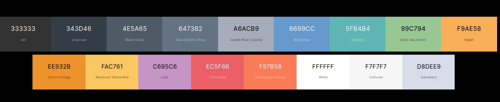
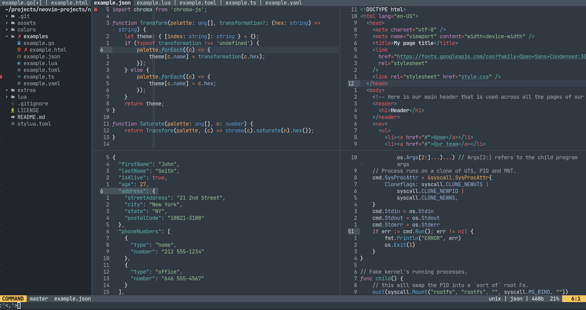
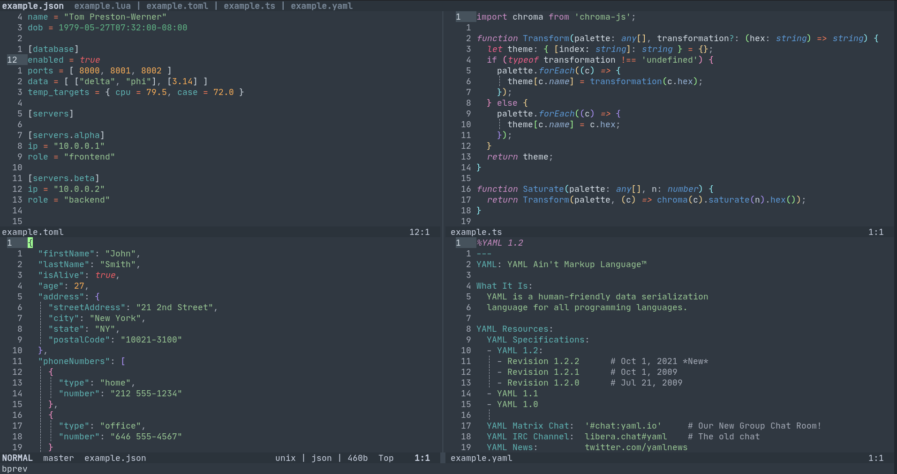

# nvim-juliana

## Palette

```lua
require('nvim-juliana').colors
```



## Screenshots




## Description

Port of Sublime's Mariana Theme for Neovim for short attention span devs with Tree-sitter support.

## Installation

Requirements: `NVIM v0.8.0-dev`.

Plug it with your favorite plugin manager.

- Packer:

```lua
use 'kaiuri/nvim-juliana'
```

## Usage

- Vimscript:

```vim
colo juliana
```

- Lua:

```lua
vim.cmd('colo juliana')
```

## Configuration

There's none, but I might add a `contrast` one if there's demand. One shouldn't spend too much time tinkering with their `.rc` files instead of writing code.

### Suggestions

If you're using tree-sitter's `typescript` you can get prettier highlights by modifying your `nvim-treesitter` settings to add additional `vim_regex_highlighting` for `typescript` _e.g._:

```lua
require('nvim-treesitter.configs').setup {
    -- ...
    highlight = {
    -- ...
      additional_vim_regex_highlighting = { 'typescript' },
    -- ...
    }
    -- ...
```

## Plugin Support(Tested)

- [nvim-semantic-tokens](https://github.com/theHamsta/nvim-semantic-tokens)
- [vim-sneak](https://github.com/justinmk/vim-sneak)
- [nvim-treesitter](https://github.com/nvim-treesitter/nvim-treesitter)
- [telescope.nvim](https://github.com/nvim-telescope/telescope.nvim)
- [nvim-cmp](https://github.com/hrsh7th/nvim-cmp)
- [indent-blankline.nvim](https://github.com/lukas-reineke/indent-blankline.nvim)
- [nvim-tree.lua](https://github.com/kyazdani42/nvim-tree.lua)
- [nvim-web-devicons](https://github.com/kyazdani42/nvim-web-devicons)
- [lualine.nvim](https://github.com/nvim-lualine/lualine.nvim) - on `auto`
- [nvim-ts-rainbow](https://github.com/p00f/nvim-ts-rainbow)
- [gitsigns.nvim](https://github.com/lewis6991/gitsigns.nvim)
- [fennel.vim](https://github.com/bakpakin/fennel.vim)

## Alacritty Theme

There's a theme for [Alacritty](https://github.com/alacritty/alacritty/) available at [extras](./extras/juliana_alacritty.yml).

## Feature request

If any language is being poorly supported, please make a new issue attached with an image of how that language looks on Sublime-Text.

If a plugin you use isn't rightly supported, please, make a new issue attached with a link to said plugin and I'll do my best to support it.

## Pull Requests

Use the [Conventional Commits](https://www.conventionalcommits.org/en/v1.0.0/) style for your commits, that's it.

# Credits

- [Mariana - Sublime HQ Pty Ltd, Dmitri Voronianski](http://www.sublimetext.com/).
