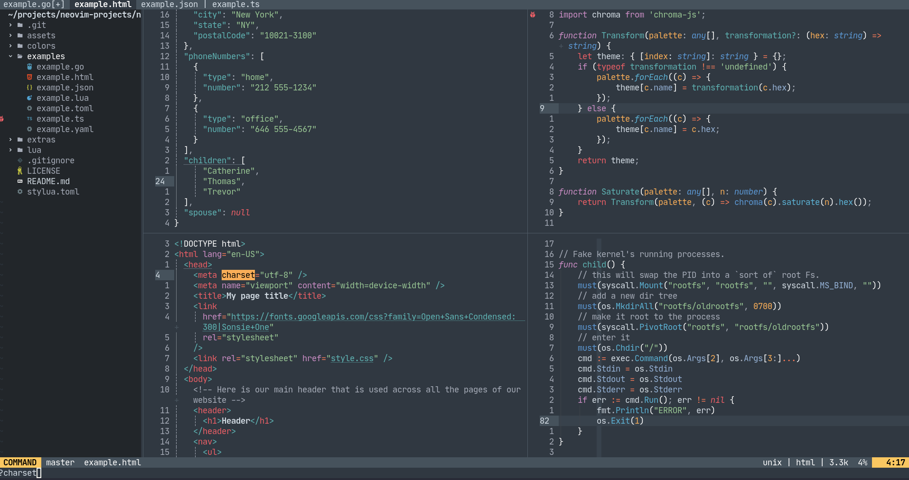

# nvim-juliana

Port of Sublime's Mariana Theme for Neovim for short attention span devs with Tree-sitter support and custom highlights - `dev` branch.


---

## Usage

### Installation

Requirements: `NVIM v0.9.0-dev`.

Plug it with your favorite plugin manager.

- Packer:

```lua
use { 'kaiuri/nvim-juliana',
    -- branch = 'dev' -- separate experimental branch with way better highlights
}
--- then
vim.cmd 'colo juliana'
```

- Color palette

```lua
require('nvim-juliana').colors
```

Note: `dev` uses custom Tree-sitter queries to better highlight code. I use it daily and update it frequently. Current languages with custom Tree-sitter highlight are `bash`, `json`, `lua`, `markdown`, `typescript` and `yaml`.

## Screenshots

#### `dev` branch


#### `master` branch



## Plugin Support - non-exhaustive list

- [vim-sneak](https://github.com/justinmk/vim-sneak)
- [nvim-treesitter](https://github.com/nvim-treesitter/nvim-treesitter)
- [telescope.nvim](https://github.com/nvim-telescope/telescope.nvim)
- [nvim-cmp](https://github.com/hrsh7th/nvim-cmp)
- [indent-blankline.nvim](https://github.com/lukas-reineke/indent-blankline.nvim)
- [nvim-tree.lua](https://github.com/kyazdani42/nvim-tree.lua)
- [nvim-web-devicons](https://github.com/kyazdani42/nvim-web-devicons)
- [lualine.nvim](https://github.com/nvim-lualine/lualine.nvim)
- [nvim-ts-rainbow](https://github.com/p00f/nvim-ts-rainbow)
- [gitsigns.nvim](https://github.com/lewis6991/gitsigns.nvim)
- [fennel.vim](https://github.com/bakpakin/fennel.vim)
- [nvim-semantic-tokens](https://github.com/theHamsta/nvim-semantic-tokens) - This is a temporary plugin which enables semantic token based highlighting.
- [nvim-notify](https://github.com/rcarriga/nvim-notify)

## Extras

- Alacritty: There's a theme for [Alacritty](https://github.com/alacritty/alacritty/) available at [extras](./extras/juliana_alacritty.yml).

## Contributing

- If any language is being poorly supported, please make a new issue attached with an image of how that language looks on Sublime-Text.
- If a plugin you use isn't rightly supported, please, make a new issue attached with a link to said plugin and I'll do my best to support it.
- Issues that have been inactive for more than 10 days are considered stale and will be closed if they aren't bug related.
- Use the [Conventional Commits](https://www.conventionalcommits.org/en/v1.0.0/) style for your commits, that's it.

## Credits

- [Mariana - Sublime HQ Pty Ltd, Dmitri Voronianski](http://www.sublimetext.com/).
